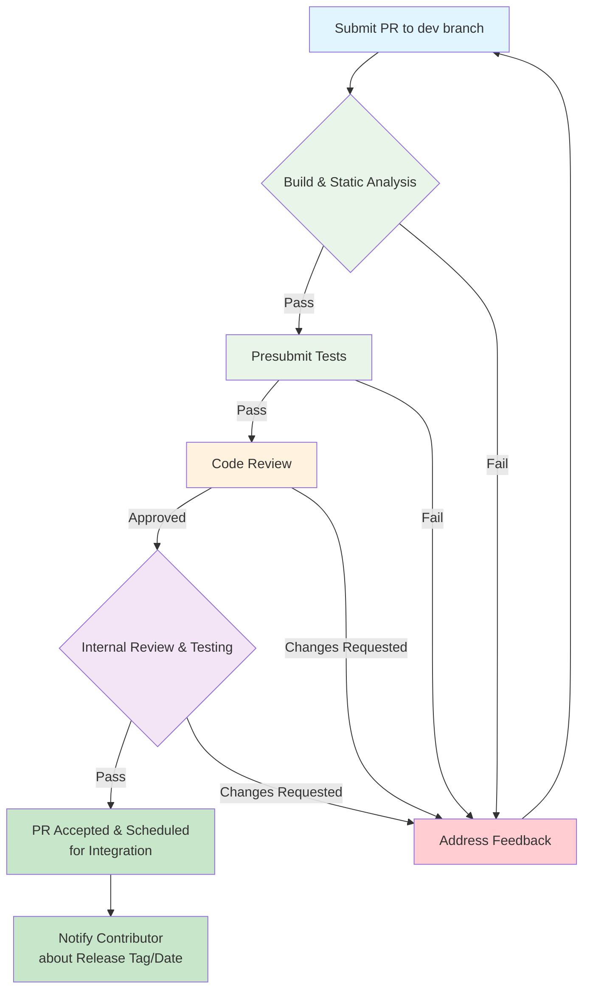

## How to contribute to AOCL-LibM

Thank you for your interest in contributing to AOCL-LibM! This document provides guidelines for contributing to the AMD Optimized CPU Library for Math functions.

> **Note:** For detailed build instructions, prerequisites, and testing commands, refer to [docs/CMakeBuildSystem.md](docs/CMakeBuildSystem.md).

---

#### **Do you intend to add a new feature or change an existing one?**

That's great; we are interested in hearing your ideas!

* You may wish to introduce your idea by opening an [issue](https://github.com/amd/aocl-libm-ose/issues/new) to describe your new feature. This allows you the chance to open a dialogue with other developers, who may provide useful feedback.

#### **Did you find a bug?**

* **Check if the bug has already been reported** by searching on GitHub under [Issues](https://github.com/amd/aocl-libm-ose/issues).

* If you can't find an open issue addressing the problem, please feel free to [open a new one](https://github.com/amd/aocl-libm-ose/issues/new). Some things to keep in mind as you create your issue:
   * Be sure to include a **concise and descriptive title**.
   * Putting some time into writing a **clear description** will help us understand your bug and how you found it.
   * Include the **AOCL-LibM version number** and the **commit ID** (git hash) corresponding to the code that exhibits your reported behavior.
   * Tell us about **your environment**: hardware microarchitecture, OS, compiler (including version), build options.
   * If your bug involves behavior observed after linking to AOCL-LibM, please provide a **minimal code sample** that developers can run to reproduce the error.

#### **Did you write a patch that fixes a bug?**

If so, great, and thanks for your efforts! Please submit a new GitHub [pull request](https://github.com/amd/aocl-libm-ose/pulls) with the patch.

* Ensure the PR description clearly describes the problem and solution. Include any relevant issue numbers, if applicable.
* Please limit your PR to addressing one issue at a time.

---

## Pull Request Process

**Important Notes:**
- All pull requests must target the `dev` branch
- [Link related issues](https://docs.github.com/en/issues/tracking-your-work-with-issues/linking-a-pull-request-to-an-issue) in PR description
- Commit authorship is preserved when your change is integrated



Internal review and testing includes the following validation phases:

| Phase | Checks |
|:------|:-------|
| **Accuracy** | Accuracy measured in ULP should not regress vs baseline across supported ISAs (AVX, AVX2, AVX512) and architectures (Zen-Zen5) |
| **Conformance** | Special value handling (NaN, Inf, ±0) |
| **Integration** | Full regression suite, multi-compiler (GCC, Clang, LLVM/Windows) |
| **Build** | No warnings across all platforms |
| **Performance** | No regression vs baseline |
| **Pre-Merge** | Documentation updated, contributor attribution in place |

### Commit Message Format

```
<scope>:<component>:<function>: <description>
```

> **Note:** We do not require an issue ID in every commit message. If there is a related GitHub issue, link it in the PR description. Optionally, you may reference it in the commit body (e.g., `Fixes #123`), but this is not mandatory.

**Scope Values and Examples:**

| Scope | Description | Example |
|-------|-------------|---------|
| `libm` | Core library source code | `libm:src:cexp: Add AVX512 support` |
| `gtests` | Test framework | `gtests:exp: Fix ULP computation` |
| `docs` | Documentation | `docs:api-guide: Add missing functions` |
| `CMake` | Build system | `CMake: Enable LLVM/Clang` |
| `Examples` | Example code | `Examples: Add vectorized sincos demo` |

**Commit Pattern Examples:**

- `scope:component:function` — `libm:src:vrs16_log2f: Fix 512-bit intrinsic`
- `scope:component` — `libm:iface: Fix atan2 dispatch`
- `scope` only — `gtests: Fix ULP computation`

---

## Testing Requirements

Before submitting a PR, ensure your changes pass:

- **Accuracy** (`-t accu`): ULP within acceptable bounds for variant type
- **Conformance** (`-t conf`): IEEE-754 compliance, handling special values (NaN, Inf, ±0)
- **Performance** (`-t perf`): No significant regression

> **Note:** Conformance tests are only supported for scalar (`-e 1`) and vector array (`-e 32`) variants. For other vector widths (`-e 2/4/8/16`), ensure accuracy and performance tests pass.

---

## Adding a New Function Variant

When adding a new math function or variant, the following files typically need to be modified:

| Category | Files/Directories | Description |
|----------|-------------------|-------------|
| **Public Headers** | `include/external/amdlibm.h`, `include/external/amdlibm_vec.h` | Add function declarations (all routines use the `amd_` prefix, e.g. `amd_exp`, `amd_vrd4_exp`, `amd_vrsa_expf`) |
| **Internal Headers** | `include/libm/__alm_func_internal.h`, `include/libm/entry_pt.h`, `include/libm/iface.h`, `include/libm_amd.h` | Update internal declarations/macros needed for compilation, dispatch/redirect, and test/build integration. These headers are not part of the installed public API. |
| **Interface Layer** | `src/iface/<func>.c` | Dispatch logic for the function |
| **Optimized Implementation** | `src/optimized/<func>.c` | Primary optimized scalar implementation |
| **ISA-Specific** | `src/isa/avx/`, `src/isa/avx2/`, `src/isa/avx512/` | Vector implementations (vrd2, vrd4, vrs4, vrs8, etc.) |
| **Architecture-Specific** | `src/arch/zen*/` (zen, zen2, zen3, zen4, zen5) | Microarchitecture-tuned variants |
| **Build System** | `src/*/CMakeLists.txt` | Add source files to build |
| **Tests** | `gtests/<func>/` | Create test directory with accuracy, conformance, and performance tests |

For detailed architecture and implementation guidance, refer to the source code of existing functions as examples. For static vs dynamic dispatch, see [CMakeBuildSystem.md - Static Dispatch](docs/CMakeBuildSystem.md#48-static-dispatch-configuration-linux-only).

---

## License

AOCL-LibM is licensed under the BSD 3-Clause License. See [LICENSE](LICENSE) for details.

By contributing to AOCL-LibM, you agree that your contributions will be licensed under the same BSD 3-Clause License.

---

## Getting Help

- **Documentation**: See `docs/` directory; [docs/CMakeBuildSystem.md](docs/CMakeBuildSystem.md) for build details
- **Issues**: [GitHub Issues](https://github.com/amd/aocl-libm-ose/issues)
- **Contact**: toolchainsupport@amd.com
- **Support**: [AMD Developer Support](https://www.amd.com/en/developer/aocc/compiler-technical-support.html)

---

Here at the AOCL-LibM project, we ❤️ our community. Thanks for helping to make AOCL-LibM better!

— The AMD AOCL-LibM Team
