# AMD LibM Test Suite - Flowcharts

**Generated:** October 10, 2025

---

## 1. Main Execution Flow

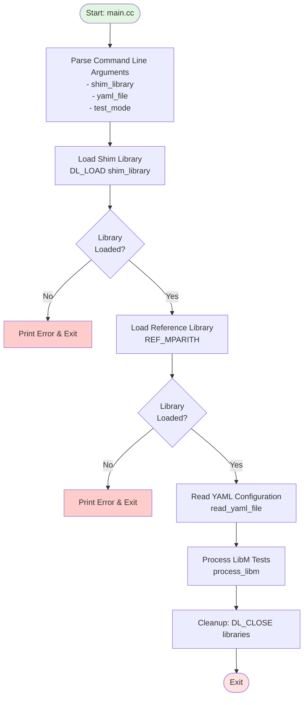

---

## 2. YAML Processing Flow

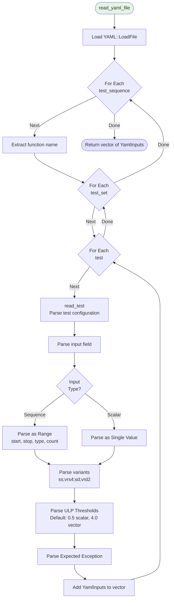

---

## 3. Test Processing and Dispatch Flow

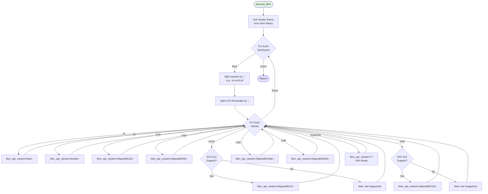

---

## 4. API Variant Processing Flow

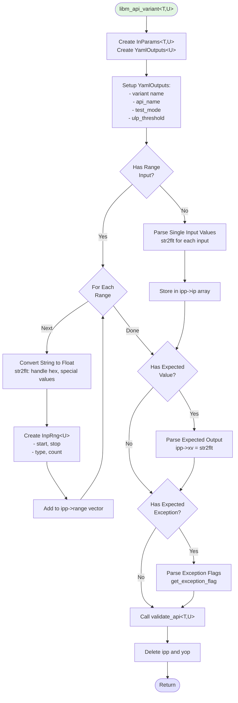

---

## 5. API Validation and Routing Flow

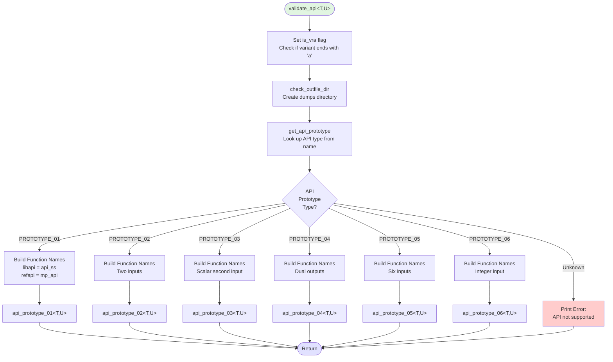

---

## 6. API Prototype Execution Flow (Example: Prototype 01)

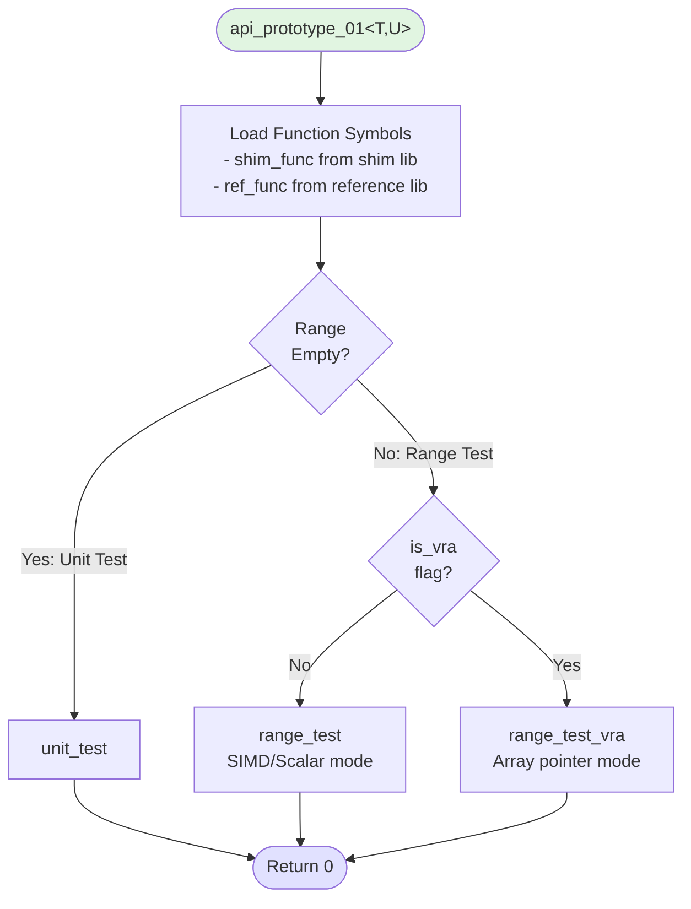

---

## 7. Unit Test Execution Flow

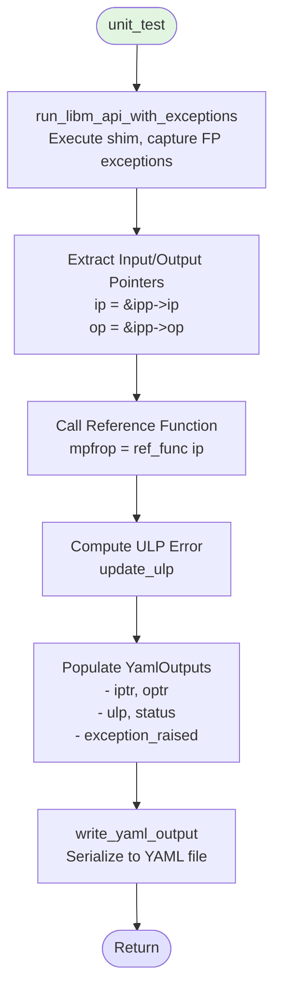

---

## 8. Range Test Execution Flow (Non-VRA)

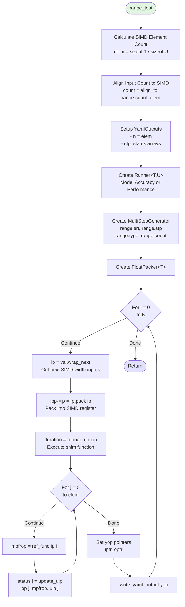

---

## 9. Range Test VRA Execution Flow

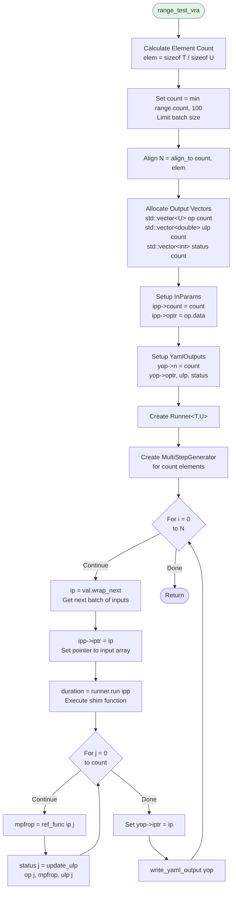

---

## 10. Runner Execution Flow

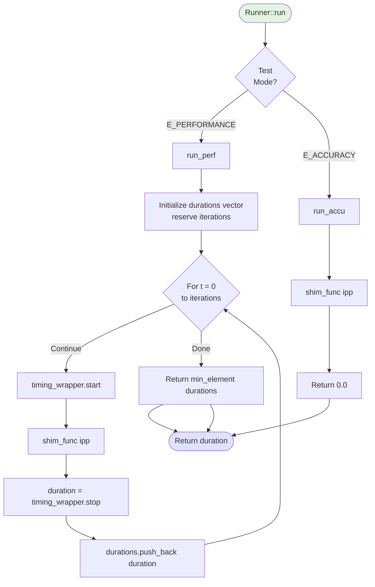

---

## 11. ULP Calculation Flow

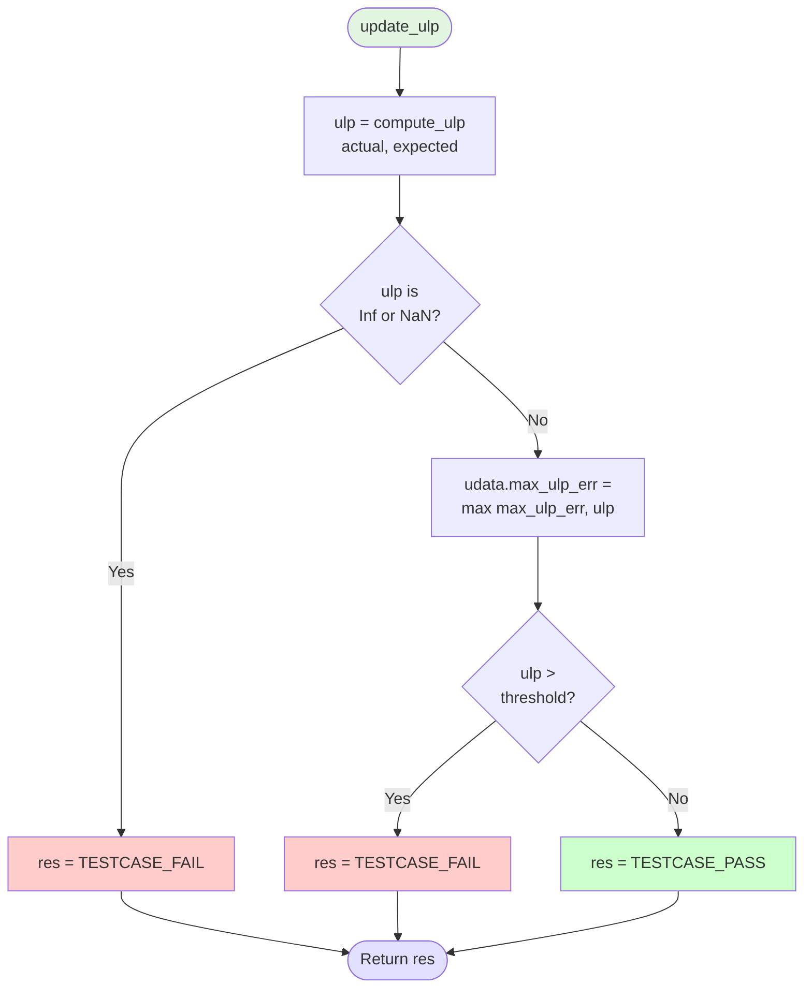

---

## 12. Compute ULP Flow

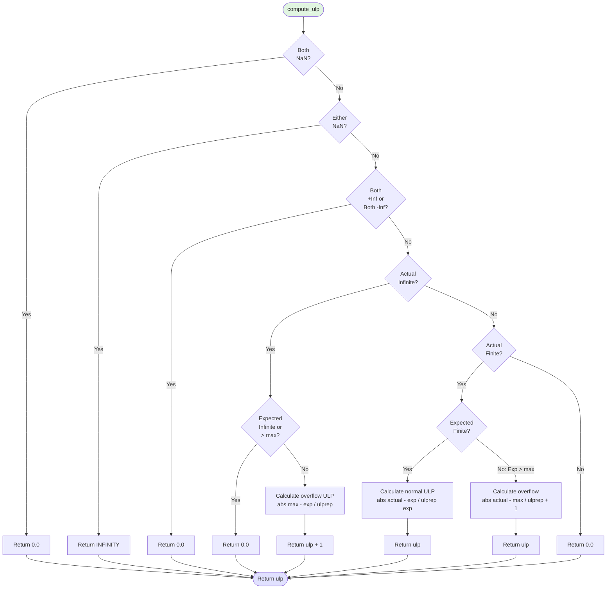

---

## 13. YAML Output Serialization Flow

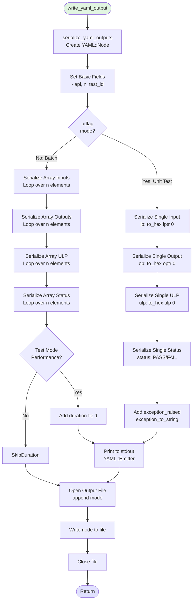

---

## 14. Input Generator Flow (MultiStepGenerator)

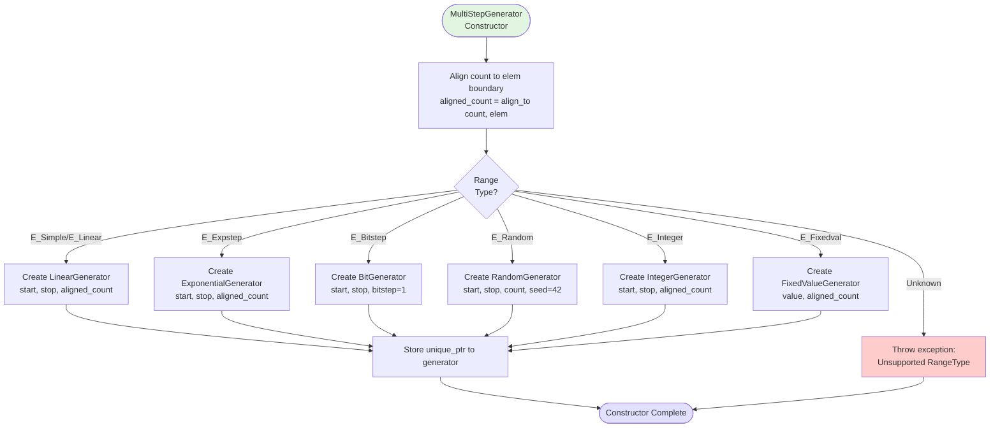

---

## 15. Exception Handling Flow

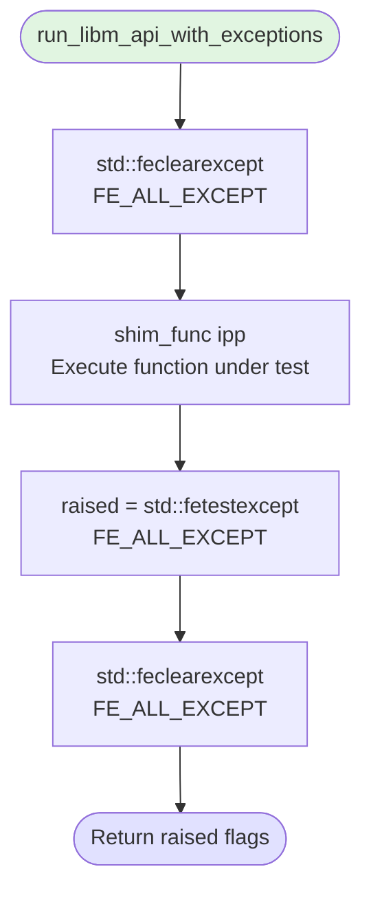

---

## 16. String to Float Conversion Flow

```mermaid
flowchart TD
    Start([str2flt]) --> CheckSpecial{String<br/>Value?}

    CheckSpecial -->|"max"| SetMax[rhs = numeric_limits::max]
    CheckSpecial -->|"min"| SetMin[rhs = numeric_limits::min]
    CheckSpecial -->|"min_subnormal"| SetMinSub[rhs = denorm_min]
    CheckSpecial -->|"max_subnormal"| SetMaxSub[rhs = min - denorm_min]
    CheckSpecial -->|"qnan"| SetQNaN[rhs = quiet_NaN]
    CheckSpecial -->|"snan"/"nan"| SetSNaN[rhs = signaling_NaN]
    CheckSpecial -->|"inf"| SetInf[rhs = infinity]
    CheckSpecial -->|Other| CheckFormat{Format<br/>Type?}

    CheckFormat -->|Decimal/Scientific| ParseDecimal[std::stof / std::stod<br/>value]
    CheckFormat -->|Hexadecimal| ParseHex[std::stoul / std::stoull<br/>base 16]
    ParseHex --> MemCopy[std::memcpy to float/double]

    SetMax --> ReturnTrue
    SetMin --> ReturnTrue
    SetMinSub --> ReturnTrue
    SetMaxSub --> ReturnTrue
    SetQNaN --> ReturnTrue
    SetSNaN --> ReturnTrue
    SetInf --> ReturnTrue
    ParseDecimal --> ReturnTrue
    MemCopy --> ReturnTrue([Return true])

    ParseDecimal -.Invalid.-> CatchError[Catch exception<br/>Return false]
    ParseHex -.Invalid.-> CatchError
    CatchError --> ReturnFalse([Return false])

    style Start fill:#e1f5e1
    style ReturnTrue fill:#ccffcc
    style ReturnFalse fill:#ffcccc
```

---

## 17. Complete Test Lifecycle

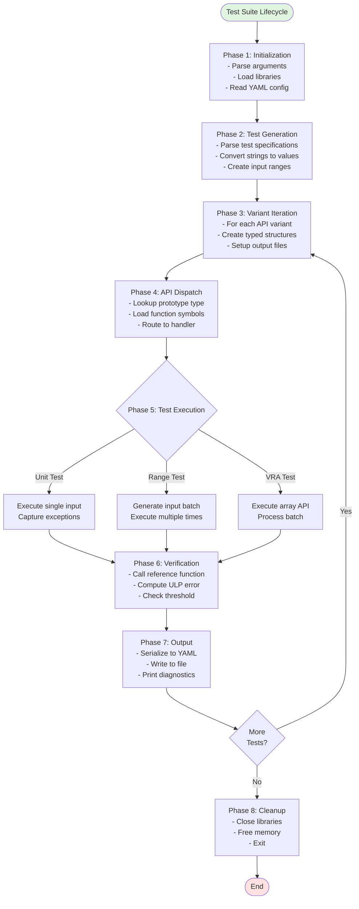

---

## 18. Data Structure Relationships

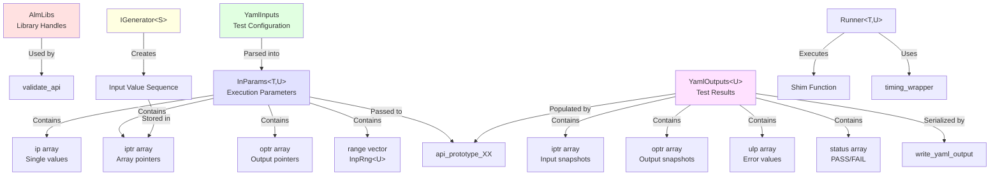

---

## 19. Performance Test Optimization Flow

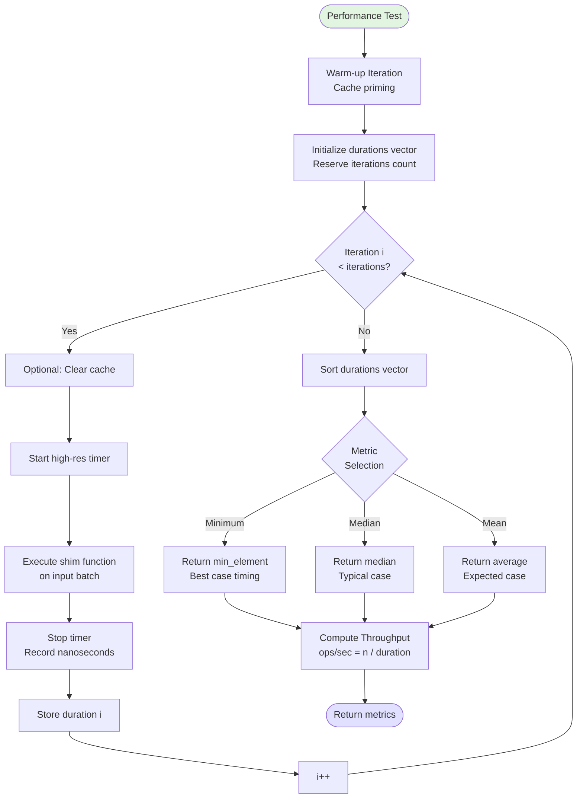

---

## 20. Error Handling and Recovery Flow

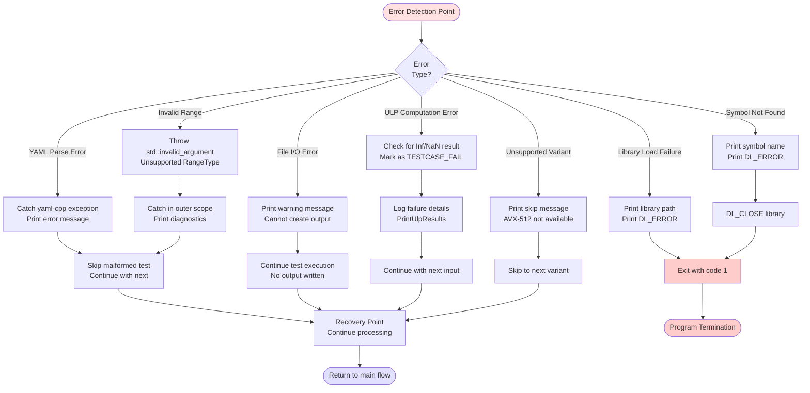

---

## Summary

These flowcharts illustrate the complete execution flow of the AMD LibM test suite, from command-line parsing through test execution and result serialization. Key aspects covered:

1. **Main execution paths** - Initialization, library loading, and cleanup
2. **YAML processing** - Configuration parsing and test generation
3. **Variant dispatch** - Routing to appropriate type-specific handlers
4. **Test execution modes** - Unit tests, range tests, and VRA tests
5. **ULP verification** - Accuracy computation and threshold checking
6. **Performance measurement** - Timing and throughput calculation
7. **Data flow** - Structure relationships and transformations
8. **Error handling** - Recovery strategies for various failure modes

The modular design allows for independent testing of each component while maintaining a clear overall execution sequence.
